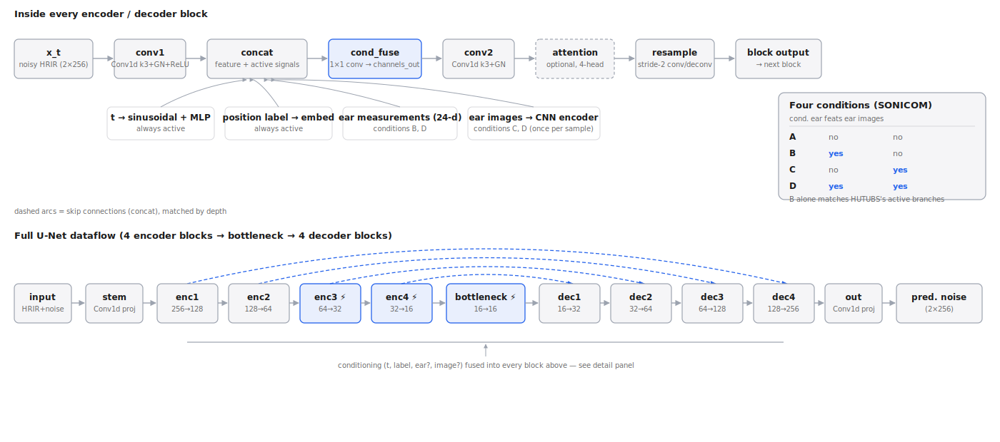

# HRTF DDPM — HUTUBS baseline + SONICOM four-condition ablation

Reimplementation of the conditional DDPM from arXiv:2501.02871 for HRTF
personalization. Originally validated on HUTUBS as a baseline
("HUTUBS_model" / condition B below); the same codebase now also trains
on SONICOM to isolate the contribution of anthropometric and ear-image
conditioning through four ablation conditions.



## Architecture (brief)

A DDPM that predicts the added noise on 2-channel (L/R) HRIR waveforms
(256 samples), conditioned on: diffusion timestep, measurement point /
direction-of-arrival, and — depending on which of the four conditions is
active — anthropometric **ear** features and/or a pair of ear photos.

- **Backbone:** 1D U-Net — 4 encoder blocks → bottleneck → 4 decoder
  blocks, skip connections via concatenation (5 channel levels —
  (4,8,16,32,64)×base_channels — give 4 transitions/blocks, not 5).
- **Each block:** `Conv1d(k=3) → norm → ReLU → Conv1d(k=3) → norm`, with
  every active conditioning signal projected, concatenated channel-wise,
  and fused back down via a 1×1 conv (`cond_fuse`) before the second conv.
- **Self-attention:** 4-head attention, by default on the two deepest
  encoder blocks plus the bottleneck (`--full_attention` puts it on all 4
  encoder blocks instead, for a controlled comparison).
- **Conditioning branches** (see diagram): timestep and position label are
  always active; ear measurements and ear images are each independently
  switchable per condition. A branch that's off doesn't just go unused —
  it isn't created at all (no weights, no kwarg read), which is what
  keeps the four conditions architecturally comparable rather than the
  same oversized network with parts zeroed out.

## The four SONICOM conditions

| Condition | Ear measurements | Ear images | Notes |
| --- | --- | --- | --- |
| A — unconditioned | off | off | floor — no personalization signal at all |
| B — anthro-only | on | off | same active branches as the HUTUBS baseline |
| C — image-only | off | on | image encoder is cold-started (see below) |
| D — anthro + image | on | on | image encoder cold-started, ear branch reused |

All four use the same SONICOM subject cohort, the same 5-fold
subject-level CV splits, and the same training budget — set once via
`--dataset sonicom --condition {A,B,C,D}`; everything else about the run
(architecture, loss, schedule) is identical across conditions by
construction, not by convention.

## What matches the paper

| Aspect | Paper | This code |
| --- | --- | --- |
| Timesteps | 600 | 600 |
| Beta schedule | linear, 1e-4 → 0.02 | same |
| Channel-mult ratios | (4, 8, 16, 32, 64) | same ratios (scaled by `base_channels`) |
| Conv kernels | k=3 pad=1 (blocks), k=4 s=2 (resample) | same |
| Self-attention | 4 heads | same |
| Skip connections | concatenation | same |
| Conditioning fusion | concatenation | same |
| LSD metric | Eq. 9, K=44 bands, 0–15 kHz | same |

## What differs from the paper (and why)

| Aspect | Paper | This code | Reason |
| --- | --- | --- | --- |
| U-Net depth | "5 encoder blocks" (paper text) | 4 encoder blocks (4 transitions across 5 channel levels) | fencepost mismatch in the paper's wording, not a missing layer |
| Normalization | BatchNorm | GroupNorm | BatchNorm degrades at small spatial lengths in deep encoder levels |
| Channel width | literal (4,8,16,32,64) | ×`base_channels` (default 8) | literal paper sizes are non-functional (too narrow) |
| Self-attention placement | after every downsampling block | two deepest blocks by default (`--full_attention` restores all 4) | ~4–6× speedup, not yet empirically ablated on this codebase |
| Loss | L2 (implied) | Combined L1 (time) + L1 (freq. magnitude) | experiment aligned with the LSD metric, not a paper match |
| LR schedule | simple decay | LinearLR warmup + ReduceLROnPlateau | pairs better with early stopping |
| Evaluation protocol | sample-level 80/20 split on one released version (leaks subjects) | subject-level k-fold CV, no leakage | primary source of the ~7.6 dB (ours) vs. 5.1 dB (paper) LSD gap on HUTUBS |
| Anthropometric features | count/selection unclear | ear_dim=24 only, head_dim=0 | matches SONICOM's ear-only CSV (no head/torso data exists there) |
| Image conditioning | not covered by the paper | new: `ImageEncoder` + per-block `image_fc` | SONICOM ablation studies whether ear photos add anything over anthropometric params alone |

## Transfer learning: HUTUBS → SONICOM

`--pretrained_checkpoint <dir>` partially initializes a SONICOM run from a
HUTUBS fold checkpoint (fold *N* loads that HUTUBS run's `unet_fold{N}.pt`).
"Partially" is doing real work here — HUTUBS and SONICOM aren't
architecturally identical runs, so this is never a full checkpoint load.

**Why it can't be a full load.** HUTUBS uses a 440-point measurement grid;
SONICOM uses a 793-point grid with a different sampling pattern (not a
subset or refinement of HUTUBS's grid — see `dataset.py`'s dynamic
`measurement_points`). The position-label embedding (`nn.Embedding(labels,
channels_out)` in every block) is sized to that count, so its shape never
matches across datasets. Separately, `cond_fuse`'s input width depends on
*how many* conditioning signals are concatenated together, which changes
per condition (2 base + label + optional head + optional ear + optional
image) — so `cond_fuse` only matches HUTUBS's checkpoint when a
condition's active-branch set is identical to HUTUBS's (label + ear, no
image), which is exactly condition B.

**What the loader actually does** (`load_matching_state_dict` in
`utils.py`): walk every tensor in the checkpoint, and copy it into the new
model only if a parameter of that exact name *and* shape exists there.
Anything that doesn't match — a resized embedding table, a differently-shaped
fusion layer, an entire branch (the image encoder) that didn't exist in
HUTUBS at all — is left at its fresh random initialization instead of
erroring. This is pure shape-matching with no condition-specific logic, and
it explains a different outcome per condition:

| Condition | position label | `ear_fc` | `cond_fuse` | image branch | backbone (conv/GN/attn) |
| --- | --- | --- | --- | --- | --- |
| A | reinit (793≠440) | n/a (off) | reinit (3≠4 concat terms) | n/a (off) | loaded |
| B | reinit (793≠440) | **loaded** (24-d matches) | **loaded** (same active set as HUTUBS) | n/a (off) | loaded |
| C | reinit | n/a (off) | reinit (new image term) | cold start (never existed) | loaded |
| D | reinit | **loaded** | reinit (new image term) | cold start | loaded |

The backbone convolutions, GroupNorms, self-attention, and the timestep
embedding never depend on the dataset or the condition, so they transfer
in all four cases — that's the majority of the parameter count. Condition
B is the only one that also reuses the ear branch and the fusion layer,
since it's the one condition whose active conditioning signals exactly
match HUTUBS's. Omit `--pretrained_checkpoint` for a fully cold-started
run (still a valid comparison point, just slower to converge).

## Loading both datasets

`dataset.py` is a shared `HRTFDataset` base class with two subclasses,
`HUTUBSDataset` and `SONICOMDataset`, differing only in the filename
pattern used to discover subjects. Everything else — anthro-CSV parsing,
normalization, k-fold splitting, optional image loading — is shared, so
the two datasets can't silently drift apart from each other.

- **Subject discovery is dynamic, not a fixed range.** The loader globs
  `hrtf_directory` for `.sofa` files instead of looping over a hardcoded
  subject count, so SONICOM's sparse `P0XXX` IDs (91 subjects, non-
  contiguous) work exactly like HUTUBS's contiguous 1–96.
- **Exclusion is automatic.** A subject is dropped if its anthro-CSV row
  is entirely NaN, or if it's missing a SOFA file or CSV row. This
  replaces a hardcoded per-dataset exclusion list (HUTUBS's old
  `{18, 79, 92}` is exactly what this detects on its own).
- **Ear columns are selected by name** (`L_`/`R_` prefix), not position,
  so HUTUBS's 13 head/torso columns (which SONICOM's CSV doesn't have at
  all) never need to be counted around. Both CSVs are kept in the same
  wide layout (`SubjectID, L_d1..L_theta2, R_d1..R_theta2`) for this to
  work — SONICOM's original export was long-format (one row per ear) and
  was reshaped once into this layout.
- **Measurement point count is read from the SOFA file itself**
  (`Data.IR.shape[0]`) rather than assumed, which is what makes HUTUBS's
  440 vs. SONICOM's 793 a non-issue for data loading (model-side, it's
  the reason the position embedding can't transfer — see above).
- **Ear images load on demand, only for SONICOM conditions C/D.** Pass
  `image_dir` to `SONICOMDataset` and each `__getitem__` decodes that
  subject's `P{id:04d}_L.jpg` / `_R.jpg` pair (resized to 128×128, stacked
  as 6 channels) fresh rather than caching one copy per measurement point
  — a subject has hundreds of HRIR points but only one image pair.

Run selection is one flag: `--dataset {hutubs,sonicom} --condition
{A,B,C,D}` (HUTUBS is always forced to condition B, since it has no
images). Paths default per dataset (`./HUTUBS/...` / `./SONICOM/...`) and
can be overridden with `--hrtf_directory`, `--anthro_csv_path`,
`--image_dir`.

## Example commands

```bash
# HUTUBS baseline (unchanged from before)
python main.py --mode train --dataset hutubs

# SONICOM, condition B, cold-started
python main.py --mode train --dataset sonicom --condition B

# SONICOM, condition D, initialized from the HUTUBS baseline's checkpoints
python main.py --mode train --dataset sonicom --condition D \
    --pretrained_checkpoint ./checkpoints/HUTUBS_model

# Inference for a single fold
python main.py --mode infer --dataset sonicom --condition B --fold 1
```

## Other notes

- **EMA:** `--ema_decay` (default `0.999`), `--use_ema` (default `true`).
  Validation, checkpointing, and inference use the EMA weights by default.
- **Combined loss:** `--loss_freq_weight` (default `0.3`) blends time-domain
  L1 with an L1 term on FFT magnitude (same K=44 bands as the LSD metric),
  FFT computed with `norm='ortho'` to keep both terms on comparable scale.
- **Splits caching:** `checkpoint_dir/splits.json` + `splits_meta.json`;
  regenerated automatically if `--k_folds` changes.
- **Precision:** FP16 autocast by default; FP32 for `base_channels=16`
  (large model) to avoid overflow.
- **Metrics:** LSD (L/R + avg), ITD error, PBC, NMSE — saved per-subject
  and per-fold as `.mat`, plus `metrics_per_subject.xlsx`. Every export
  carries `subject_id` and a `model` tag (from `--model_name`, which
  defaults to `HUTUBS_model` or `SONICOM_<condition>`) so results from
  different runs join cleanly on `subject_id` for a paired Wilcoxon
  signed-rank test across conditions.
- **Output namespacing:** `--checkpoint_dir` / `--results_dir` /
  `--runs_dir` default to `./checkpoints|results|runs/<model_name>`, so
  different conditions never overwrite each other's outputs.
- Crash-safe training/inference: atomic `progress.json` writes, full
  optimizer/scheduler state in checkpoints.

## Files

| File | Contents |
| --- | --- |
| `model.py` | `DiffusionModel` (noise schedule), `ImageEncoder`, `UNet` architecture |
| `dataset.py` | `HRTFDataset` base class, `HUTUBSDataset` / `SONICOMDataset` |
| `main.py` | CLI entrypoint — dataset/condition selection, training & inference per fold |
| `utils.py` | Metrics (LSD, ITD, PBC, NMSE), plotting, `load_matching_state_dict` |
| `architecture_diagram.svg` | Block-level and full-network diagrams referenced above |
